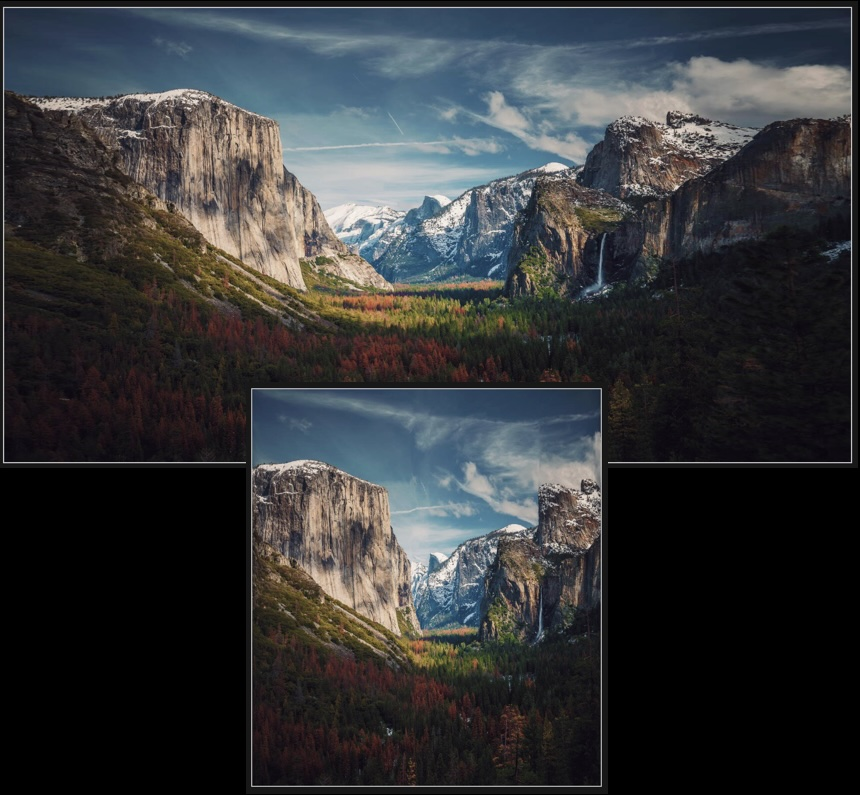

# Responsive Image Web Component

Images that just scale, intelligently, to whatever size you want them to be (within reasonable limits)



## Usage

```html
<script src="responsive-img.js"></script>
<responsive-img src="image.jpg"></responsive-img>
```

That's it. Scale the images however you like, they'll just do their thing.

## Versions

There are 4 different components, explained below in detail, but summarized here for people that don't want to read everything:

| Component                     | Speed | Quality | Notes                                            |
| ----------------------------- | ----- | ------- | ------------------------------------------------ |
| `<responsive-img>`            | ★★★★★ | ★☆☆☆☆   |                                                  |
| `<responsive-img-predictive>` | ★★★★☆ | ★★★☆☆   |                                                  |
| `<responsive-img-cached>`     | ★★★★★ | ★★★★★   | Requires one-off server-side generation of seams |
| `<responsive-img-full>`       | ☆☆☆☆☆ | ★★★★★   | Strongly recommend against using in production   |

## Demo

[Demo Here](https://voicengo.github.io/img-responsive/public/responsive-demo.html)

Or, if you want to play with it with your own images, [here is a playground](https://voicengo.github.io/img-responsive/public)

## Installation

There are two pieces to this. The web components, with various generators, and the server-side seam generator. The seam generator is not necessary, but produces better results than any of the client-friendly generators.

### Client Library

```sh
npm install responsive-image
```

Then import `responsive-image` in your project, which provides and registers the web-component:

```ts
import 'responsive-image';
```

Or include the script from jsdelivr or unpkg:

```html
<script src="https://cdn.jsdelivr.net/npm/package@version/file" />

<!-- or -->

<script src="https://unpkg.com/:package@:version/:file" />
```

### Seam Generator

To use the generator you need to have cairo installed (this is a
dependency of [node-canvas](https://github.com/Automattic/node-canvas)).

| OS      | Command                                                                                                   |
| :------ | :-------------------------------------------------------------------------------------------------------- |
| OS X    | Using [Homebrew](https://brew.sh/):<br />`brew install pkg-config cairo pango libpng jpeg giflib librsvg` |
| Ubuntu  | `sudo apt-get install build-essential libcairo2-dev libpango1.0-dev libjpeg-dev libgif-dev librsvg2-dev`  |
| Fedora  | `sudo yum install gcc-c++ cairo-devel pango-devel libjpeg-turbo-devel giflib-devel`                       |
| Solaris | `pkgin install cairo pango pkg-config xproto renderproto kbproto xextproto`                               |
| OpenBSD | `doas pkg_add cairo pango png jpeg giflib`                                                                |
| Windows | See node-canvas' [wiki](https://github.com/Automattic/node-canvas/wiki/Installation:-Windows)             |
| Others  | See node-canvas' [wiki](https://github.com/Automattic/node-canvas/wiki)                                   |

After cairo is installed, install both canvas and this package via npm:

```sh
npm install responsive-image
```

If you only need the renderer for some reason (e.g. you are building seams in another service), then you do not need cairo or canvas and can just install seams via npm

### Caveats

The responsive image component works best for horizontally or vertically scaling images within a range of approximately 0.5x to 1.5x their original size. While it can handle larger or smaller scales, the visual quality may start to quickly degrade. It is generally not recommended for images where precise pixel integrity is critical, such as tight portraits, graphs, or highly detailed technical drawings, as seam carving will introduce distortions. It is highly recommended to test your images at various sizes to ensure they meet your visual expectations.

#### CORS

Due to browser security restrictions, images loaded from a different origin (domain, protocol, or port) than the web page will trigger a Cross-Origin Resource Sharing (CORS) error. This component requires access to the raw pixel data of the image, which is restricted by CORS.

To use images from a different origin, the server hosting the images must be configured to send appropriate CORS headers (e.g., `Access-Control-Allow-Origin: *` or `Access-Control-Allow-Origin: your-domain.com`). Without these headers, the component will not be able to process the image.

#### Fallback

If the component fails to load or process the image, or throws an internal error, it will gracefully degrade to a standard `` tag, ensuring the image is still displayed.

## Options

Usage: `<responsive-img src="image.jpg" generator="random" max-carve-up-scale="5"></responsive-img>`

The random generator is used by default as it is the fastest. If a `seam` attribute is provided, however, the default will switch to `cached`, e.g. `<responsive-img src="image.jpg" seam>` or `<responsive-img src="image.jpg" seam="seamsDir/image.seam">`

| Option                         | Values                   | Default | Description                                                                                                                                                                                   |
| ------------------------------ | ------------------------ | ------- | --------------------------------------------------------------------------------------------------------------------------------------------------------------------------------------------- |
| `src`                          | URL                      |         | The URL of the image to be processed.                                                                                                                                                         |
| `seam-priority`                | Number (0-1, e.g. `0.5`) | `1`     | If set to any value under `1`, the renderer will mix seam carving and traditional image scaling together                                                                                      |
| `max-carve-up-seam-percentage` | Number (0-1, e.g. `0.5`) | `0.6`   | The maximum percentage of seams to remove when scaling the image up.                                                                                                                          |
| `max-carve-up-scale`           | Number (e.g. `3`)        | `10`    | The maximum scale factor for carving the image up.                                                                                                                                            |
| `max-carve-down-scale`         | Number (e.g. `0.5`)      | `1`     | The maximum scale factor for carving the image down.                                                                                                                                          |
| `prepare`                      | Boolean                  | false   | If set, generators will generate full sets of seams immediately upon load. This prevents a stuttering effect if images are being fluidly resized, but adds potentially unnecessary processing |

### Generator specific options

Generator specific options just get added to the `<responsive-img>` component, but are only valid with the appropriate `generator` attribute also set

#### Random & Predictive Generator Options

| Option             | Values                | Default | Description                                       |
| ------------------ | --------------------- | ------- | ------------------------------------------------- |
| `batch-percentage` | Number (0-1, e.g 0.1) | 0.1     | The percentage of seams to generate per batch     |
| `min-batch-size`   | Number (e.g. `10`)    | 10      | The minimum number of seams to generate per batch |

#### Full Generator Options

None for now

#### Cached Generator Options

| Option | Values         | Default               | Description                                                                                                      |
| ------ | -------------- | --------------------- | ---------------------------------------------------------------------------------------------------------------- |
| `seam` | Boolean or URL | `{base-src-url}.seam` | The URL of the seam file. If not provided, the path to the image is used, with the extension replaced by `.seam` |

## Seam Generator

To pre-calculate seams for use with the `cached` generator, you can use the command-line tool provided by this package via `npx`. This tool processes an image and generates a `.seam` file containing the pre-computed seam data. By default `.seam` files will be generated in the same folder as the processed images.

Example usage:

```bash
# Process a single image
npx seams process image.jpg

# Process multiple images
npx seams process image1.jpg image2.png image3.webp

# Process all images in a directory
npx seams process ./images/*.jpg

# Process all images in the current directory and its subdirectories
npx seams process ./**/*.jpg

# Output to a specific directory
npx seams process image.jpg --output-dir ./seams

# Process with specific options
npx seams process image.jpg --percent-seams 50 --vertical
```

### Seam Generator Options

| Option                   | Values         | Default       | Description                                                                                                                                                                                                                                                                               |
| ------------------------ | -------------- | ------------- | ----------------------------------------------------------------------------------------------------------------------------------------------------------------------------------------------------------------------------------------------------------------------------------------- |
| `--output-dir`, `-o`     | Directory path | Same as input | Directory where .seam files will be saved                                                                                                                                                                                                                                                 |
| `--vertical`, `-v`       | Boolean flag   | `false`       | Calculate vertical seams in addition to horizontal ones                                                                                                                                                                                                                                   |
| `--allow-straight`, `-a` | Boolean flag   | `false`       | Allow straight seams (negligible quality impact but reduces file size by ≈50%)                                                                                                                                                                                                            |
| `--step-size`, `-s`      | Number         | `1`           | Seams skip by N pixels allowing for significantly smaller, but less accurate seams. Makes seams N<sup>2</sup> times smaller (e.g. a value of 2 results in seams that are 1/4th the size). 2 is usually not very noticeable, values of 4+ start to cause a noticeable number of artifacts. |
| `--max-seams`            | Number         | `-1`          | Maximum number of seams to calculate (-1 for unlimited)                                                                                                                                                                                                                                   |
| `--percent-seams`, `-p`  | Number (1-100) | `100`         | Percentage of possible seams to calculate                                                                                                                                                                                                                                                 |

## How it works

Seam carving is a content-aware image resizing technique. It intelligently removes or adds pixels to an image, allowing it to be resized without distorting important content. [Wikedia article](https://en.wikipedia.org/wiki/Seam_carving) on the topic if you want to read more.

Historically, performing seam carving directly within a web browser was impractical due to its computationally intensive nature, requiring significant processing power for real-time image manipulation. However, we can either pre-calculate seams on a server, or cheat and throw away the entire algorithm for ones that work decently well in many scenarios.

There are four implementations of the seam carving generator, although the full implementation is not practical except for demos:

### Random Carving

The random seam carving is done by throwing away the seam carving algorithm entirely as it is too slow to run in real-time.

Instead, I'm generating a set of random seams with 100% image coverage by randomly connecting every pixel in one row to a neighboring pixel in the next. I then walk each seam, calculate its energy, and discard a batch of the lowest energy seams. Repeat until we have the desired number of seams. It generates surprisingly decent results for many images.

### Predictive Carving

Similar to random carving, I'm generating the energy map, and creating seams in batches, but then also generating a minimal energy map for each batch. The idea here is then simple -- We want "good seams" and "bad seams". Good seams are those with low energy and will be included in our batch. Bad seams "consume" energy by including the highest energy pixels so that we can filter out entire seams of high energy pixels later.

Starting from the first row of pixels, we look at a pair of pixels and try to connect it to the same pair in the next row, and what we do is simple -- The lower energy seam from above (running calculation) gets connected to the lower energy seam from below (from our minimal energy map).

The result is 1 truly optimal seam, many "very good" seams, many "very bad" seams, and a bunch of mediocre ones. We then pick a batch of good ones, discard the rest, and repeat.

### Full Carving

Fully calculates optimum seams in the browser. Useful in a demo to see what an image will look like when scaled, but should not be used in production as it is very slow.

The general algorithm is: calculate the energy at every pixel in an image. Then calculate an optimal seam through the image using dynamic programming to build an energy sum table. Remove this optimal seam, re-calculate the two tables, and repeat.

### Cached Carving

Cached carving uses the full carving method above, but instead of doing it on the fly, which is slow, it pre-calculates seams on a server. Those seams get compressed into a custom `.seam` file, which is then decoded on the client. The result is optimal seams with minimal client-side processing.

## Erm...

I just implemented the Predictive generator. It is, algorithmically, identical to the full generator when set to a batch size of 1, it's just really slow. So I tried that.

Giant MEH. The random generator is literally better in many cases. So I need to re-think the core algorithms. I was playing with a slinding window in the seam generation with decent results, but not sure what I'll end up with yet.

## TODO

### High Priority

- [x] Web component
- [x] Renderer that takes data from generators and scales to any size
- [x] Random generator
- [ ] Vertical carving
- [x] Predictive generator
- [ ] Finish full generator
- [ ] Finish cached generator
- [ ] Web workers for all generators

### Low Priority

- [ ] Masking
- [ ] Facial recognition

### Pipe Dream

- [ ] 2D carving
